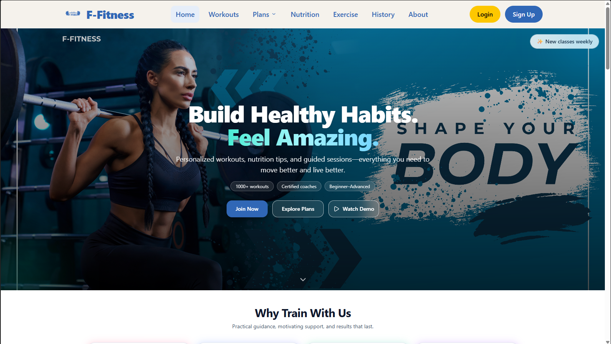

# FFitnes - Fitness & Nutrition Platform

**FFitnes** is a comprehensive fitness platform that helps users manage workouts and nutrition. Features an exercise library, custom workout plans, and food nutrition tracking to support your fitness journey.

## Screenshots

## Features

### Exercise Library

- Browse exercises by muscle group and difficulty
- Exercise descriptions with form instructions
- Filter by equipment and target area

### Workout Plans

- Create custom workout routines
- Schedule daily/weekly training plans
- Track workout progress over time

### Nutrition Tracking

- Log daily meals and food intake
- Track macronutrients and calories
- Support your fitness goals with balanced nutrition

## Tech Stack

**Frontend:** React + Vite  
**Backend:** Express + Node.js  
**Database:** MongoDB
